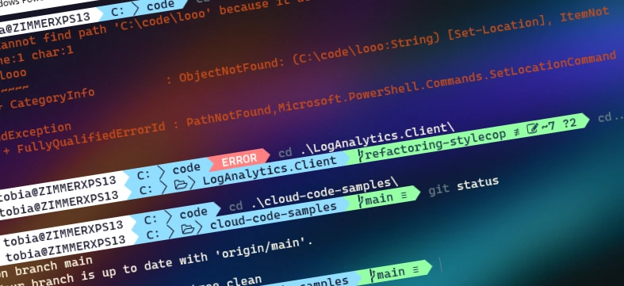
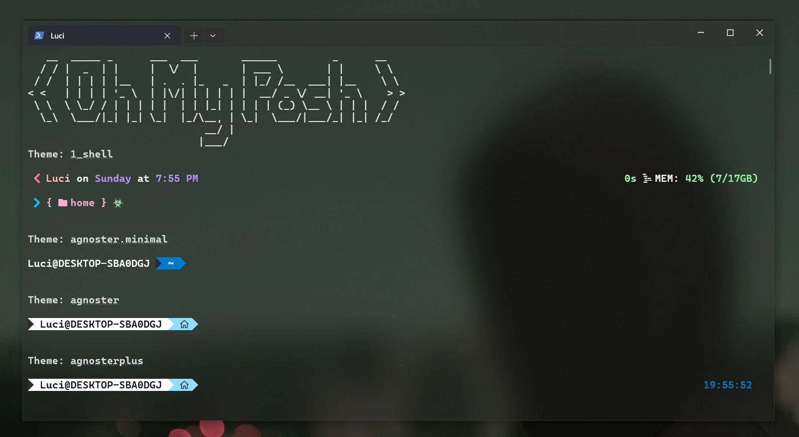

# AWESOME Powershell or Git Bash With Oh-My-Posh
<br>



## Install Windows Terminal

https://docs.microsoft.com/en-us/windows/terminal/install
<br>

## Install Nerd Fonts

To make Windows Terminal able to render the icons we're using in **zsh** later, we need to install the **Nerd-Fonts** on Windows. First, go to the Nerd-Font homepage and select a Font you like. Note that not all of them work well with all zsh themes, you may need to try out different ones. Fonts that work for me are **Anonymice Nerd Font**, **Droid Sans Mono Nerd Font**, and **Hack Nerd Font**. Then, extract the archive and install all of the `.otf` Font files.

https://www.nerdfonts.com/
<br>
## Install POSH Shell in Powershell or Git Bash

Now we need to install the **Posh** shell in our Powershell or Bash. You can easily install it in the Windows by using the commands below.

We will also install **oh-my-posh** which is a nice configuration extension to the **Posh** shell. <br>

```
winget install JanDeDobbeleer.OhMyPosh -s winget
```
#### This installs a couple of things:

- oh-my-posh.exe - Windows executable
- themes - The latest Oh My Posh themes

<br>

### Oh My Posh was designed to use Nerd Fonts. Nerd Fonts are popular fonts that are patched to include icons

#### To Install Nerd Fonts :

```
oh-my-posh font install 
```
- ### Go to Terminal and set Default font to Installer Font (CascadiyaCode)
- #### Make sure to configure your terminal to use the font you have installed


### Creates a new file for PowerShell profile, commonly used for configuring settings or functions.

```
New-Item -Path $PROFILE -Type File -Force
```

### Opens PowerShell profile for customizing environment through Notepad

```
notepad $PROFILE
```
**Insert Bellow code and Save the document**

- ```
  oh-my-posh init pwsh | Invoke-Expression"
  ```
### To allow running locally signed scripts enhances PowerShell security.

```
Set-ExecutionPolicy RemoteSigned
```
- **Type A and press Enter**

### Installs PowerShellGet module to forcefully using PowerShell command

```
Install-Module -Name PowerShellGet -Force
```
- **Type Y and press Enter**

### Installs PSReadLine module forcefully in PowerShell.

```
Install-Module PSReadLine -Force
```

### Now you can see the Changes

```
. $PROFILE
```
<br/>

## Additional

### If you are using PowerShell, you can display every available theme using the following PowerShell cmdlet

```
Get-PoshThemes
```
<br/>



### Then Copy Your Selected Theme Name And Paste it instead of  {theme name}

-  ```
   notepad $PROFILE
   ```

- ```
  oh-my-posh --init --shell pwsh --config "~/AppData/Local/Programs/oh-my-posh/themes/{theme name}.json" | Invoke-Expression
   ```

<br/>

# 💰 You can help me by Donating


<a href="https://buymeacoffee.com/pasinduljay" target="_blank"></a>
<a href="https://paypal.me/980822" target="_blank">
<br><br>
